# Maak kennis met de Raspberry Pi Pico

Dit is een Raspberry Pi Pico.


Als je een breadboard hebt, plaats dan je Raspberry Pi Pico erop.

Zorg ervoor dat de twee headers gescheiden zijn door de scheiding in het midden.

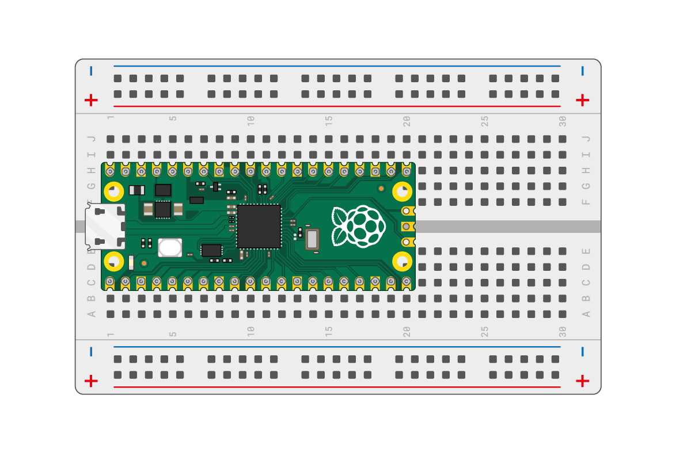
 
Steek je micro-USB-kabel in de poort aan de linkerkant van het bord.


Gedurende de opdrachten zul je de pinnummers van een Raspberry Pi Pico moeten weten. Deze kun je opzoeken in het volgende diagram.


## Installeer Thonny

In deze stap installeer je Thonny of zorg je ervoor dat je de nieuwste versie hebt. Vervolgens maak je verbinding met een Raspberry Pi Pico en voer je wat eenvoudige Python-code uit met de Shell.

- Op Windows, macOS en Linux kun je de nieuwste Thonny IDE installeren of een bestaande versie bijwerken.
- Ga in een webbrowser naar [thonny.org](https://thonny.org/)
- In de rechterbovenhoek van het browservenster zie je downloadlinks voor Windows en macOS, en instructies voor Linux.
- Download de relevante bestanden en voer ze uit om Thonny te installeren.

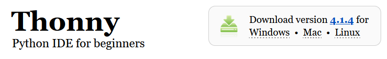

Open Thonny vanuit je start menu. Het zou er ongeveer zo uit moeten zien:

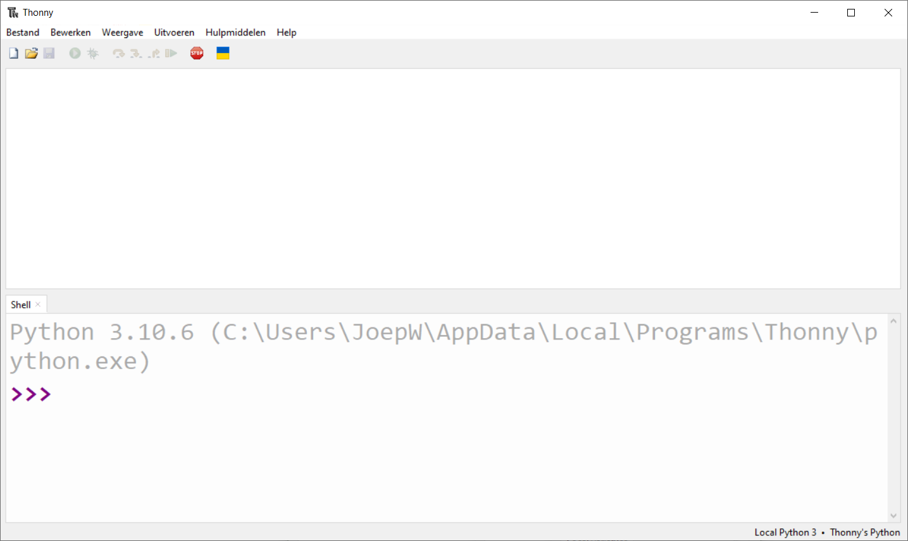

**Tip:** je kan de taal in Thonny aanpassen onder Hulpmiddelen -> Opties ... -> Algemeen -> Taal.

Je kunt Thonny gebruiken om standaard Python-code te schrijven. Typ het volgende in het hoofdvenster en klik vervolgens op de knop **Voer huidig script uit** (je wordt gevraagd om het bestand op te slaan).

```python3
print('Hallo Wereld!')
```

Je bent nu klaar om verder te gaan en je Raspberry Pi Pico aan te sluiten.

## Voeg de MicroPython-firmware toe

Als je nog nooit MicroPython op je Raspberry Pi Pico hebt gebruikt, moet je de MicroPython-firmware toevoegen.

Zoek de BOOTSEL-knop op je Raspberry Pi Pico.


Druk op de BOOTSEL-knop en houd deze ingedrukt terwijl je het andere uiteinde van de micro-USB-kabel op je computer aansluit.


Hierdoor komt je Raspberry Pi Pico in de USB-massastorage-modus.

In de rechteronderhoek van het Thonny-venster zie je de versie van Python die je momenteel gebruikt.

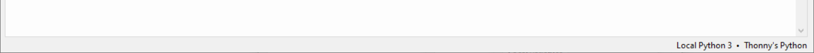

Klik op de Python-versie en kies ‘MicroPython (Raspberry Pi Pico)’:

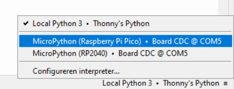

Als je deze optie niet ziet, controleer dan of je je Raspberry Pi Pico hebt aangesloten.

Er verschijnt een dialoogvenster om de nieuwste versie van de MicroPython-firmware op je Raspberry Pi Pico te installeren. Selecteer in dit dialoogvenster Mycropython family **RP2** en variant **Raspberry Pi * Pico W  / Pico WH**.

Klik op de knop **Installeren** om de firmware naar je Raspberry Pi Pico te kopiëren.

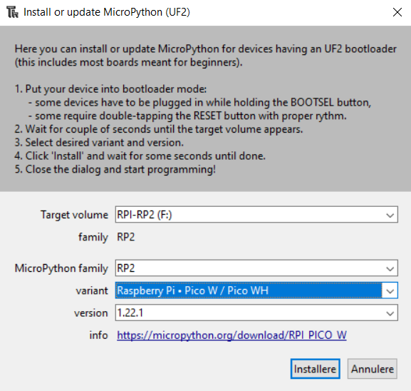

Wacht tot de installatie is voltooid en klik op **Sluiten**.

Je kunt ook toegang krijgen tot het firmware-installatiemenu door op ‘MicroPython (Raspberry Pi Pico)’ in de statusbalk te klikken en ‘Interpreter configureren …’ te kiezen.

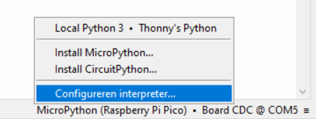

De instellingen van de interpreter worden geopend.

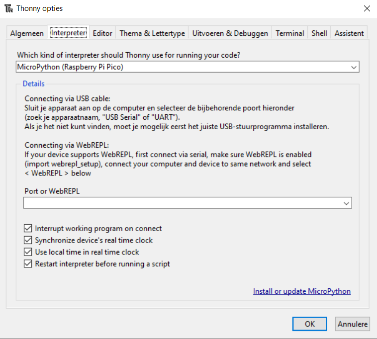

Klik op **Install or update MicroPython.**

Je wordt gevraagd om je Raspberry Pi Pico aan te sluiten terwijl je de BOOTSEL-knop ingedrukt houdt.


Klik vervolgens op **Installeren**.

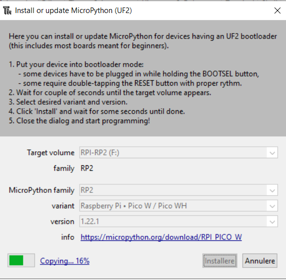

Wacht tot de installatie is voltooid en klik op **Sluiten**.

Je hoeft de firmware niet elke keer bij te werken wanneer je je Raspberry Pi Pico gebruikt. De volgende keer kun je hem gewoon in je computer steken zonder op de BOOTSEL-knop te drukken.

## Gebruik de Shell

In deze stap ga je de Thonny Shell gebruiken om eenvoudige Python-code op je Raspberry Pi Pico uit te voeren.

Zorg ervoor dat je Raspberry Pi Pico is aangesloten op je computer en dat je de MicroPython (Raspberry Pi Pico) interpreter hebt geselecteerd.

Kijk naar het Shell-paneel onderaan de Thonny-editor.

Je zou zoiets moeten zien:

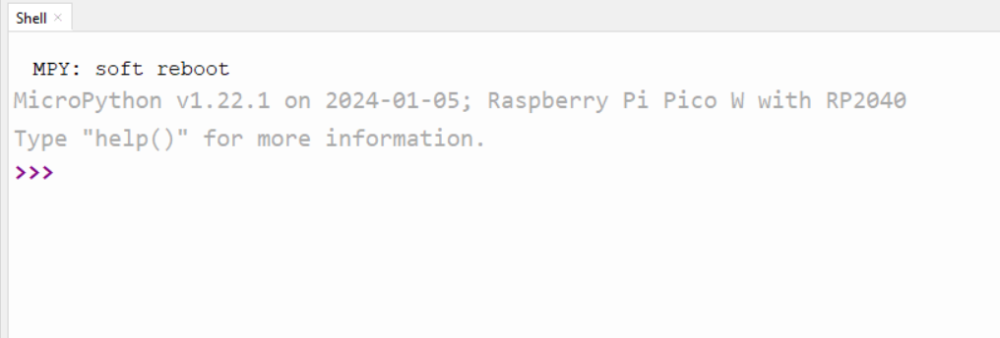

Thonny kan nu communiceren met je Raspberry Pi Pico via de REPL (read–eval–print loop), waarmee je Python-code in de Shell kunt typen en de uitvoer kunt bekijken.

Nu kun je opdrachten rechtstreeks in de Shell typen en ze worden uitgevoerd op je Raspberry Pi Pico.

Typ de volgende opdracht:

``` python
print("Hallo")
```
Druk op Enter en je ziet de uitvoer:

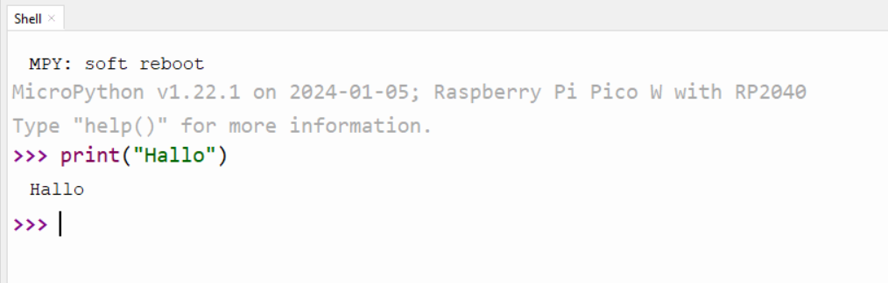

MicroPython voegt hardware-specifieke modules toe, zoals `machine`, die je kunt gebruiken om je Raspberry Pi Pico te programmeren.

Laten we een `machine.Pin` object maken dat overeenkomt met de ingebouwde LED, die toegankelijk is via GPIO-pin 25.

Als je de waarde van de LED op `1` instelt, gaat hij aan.

Voer de volgende code in en zorg ervoor dat je na elke regel op Enter drukt:

``` python
from machine import Pin
led = Pin("LED", Pin.OUT)
led.on()
```

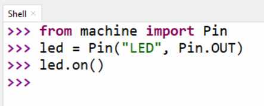

Je zou de ingebouwde LED moeten zien oplichten.


Typ de code om de waarde op `0` in te stellen om de LED uit te schakelen.

``` python
led.off()
```

Zet de LED zo vaak aan en uit als je wilt.

**Tip:** Je kunt de pijl omhoog op het toetsenbord gebruiken om snel toegang te krijgen tot eerdere regels.

Als je een langer programma wilt schrijven, is het het beste om het op te slaan in een bestand. Dat doe je in de volgende stap.

## Knipper de ingebouwde LED

De Shell is handig om te controleren of alles werkt en om snel commando’s uit te proberen. Maar het is beter om langere programma’s in een bestand te plaatsen.

Thonny kan MicroPython-programma’s rechtstreeks op je Raspberry Pi Pico opslaan en uitvoeren.

In deze stap maak je een MicroPython-programma om de ingebouwde LED aan en uit te knipperen in een lus.

Klik in het hoofdvenster van Thonny.

Voer de volgende code in om de LED te schakelen:

``` python
from machine import Pin
led = Pin("LED", Pin.OUT)

led.toggle()
```
Klik op de knop **Voer huidig script uit** om je code uit te voeren.

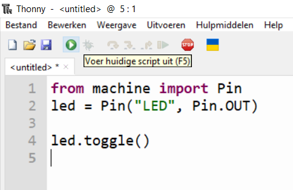

Als Thonny vraagt of je het bestand op **Deze computer** of het **MicroPython device** wilt opslaan. Kies **MicroPython device**.

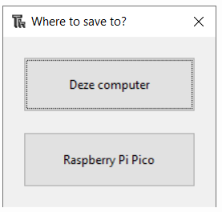

Voer `blink.py` in als bestandsnaam.

**Tip:** Je moet de bestandsextensie `.py` invoeren zodat Thonny het bestand herkent als een Python-bestand.

Thonny kan je programma opslaan op je Raspberry Pi Pico en het uitvoeren.

Je zou de ingebouwde LED telkens zien schakelen tussen aan en uit wanneer je op de knop **Voer huidig script uit** klikt.

Je kunt ook de Timer-module gebruiken om een timer in te stellen die een functie op regelmatige tijdstippen uitvoert.

Werk je code bij zodat deze er als volgt uitziet:

``` python
from machine import Pin, Timer
led = Pin("LED", Pin.OUT)
timer = Timer()

def blink(timer):
    led.toggle()

timer.init(freq=2.5, mode=Timer.PERIODIC, callback=blink)
```

Klik op **Voer huidig script uit** en je programma zal de LED aan en uit knipperen totdat je op de knop **Stoppen** klikt.

_Gebaseerd op [Getting started with the Pico](https://projects.raspberrypi.org/en/projects/getting-started-with-the-pico/), gedeeltelijk vertaald door Microsoft CoPilot_