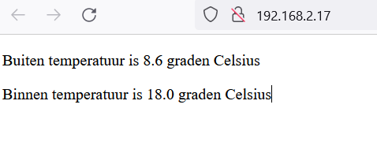

# Opzetten van een webserver op Raspberry Pi Pico W

Voor deze instructie gaan we ervan uit dat je de [Raspberry Pi Pico W verbonden hebt met het Wifi](raspberry-pi-pico-w-verbinden-met-wifi.md).

> [!CAUTION]
> Wachtwoorden moeten veilig en privé worden bewaard. In deze stap voeg je je WiFi-wachtwoord toe aan je Python-bestand. Zorg ervoor dat je het bestand niet deelt met iemand aan wie je je wachtwoord niet zou willen vertellen.

1. Kopieer het bestand [`verbinden-met-wifi.py`](code/verbinden-met-wifi.py) naar een nieuw bestand `web-server.py`. We voegen nog een paar benodigde imports toe aan de bestaande imports:
    ```python
    import socket
    ```

> [!TIP]
> Een socket is de manier waarop een server kan luisteren naar een client die ermee wil verbinden. De webpagina die je momenteel bekijkt, wordt gehost op servers van de Raspberry Pi Foundation. Deze servers hebben een open socket die wacht op een verbinding van je webbrowser. Op dat moment worden de inhoud van de webpagina naar je computer verzonden. In dit geval fungeert je server als je Raspberry Pi Pico W en de client is een webbrowser op een andere computer.

2. Om een socket te openen, moet je het IP-adres en een poortnummer opgeven. Poortnummers worden door computers gebruikt om te bepalen waar verzoeken naartoe moeten worden gestuurd. Bijvoorbeeld, poort 80 wordt normaal gesproken gebruikt voor webverkeer; Stardew Valley gebruikt poort 24642 wanneer je een multiplayer spel speelt. Omdat je een webserver aan het opzetten bent, ga je poort 80 gebruiken. Maak een nieuwe functie die kan worden aangeroepen om een socket te openen. Plaats deze boven je try/except-blok. Begin door de socket een IP-adres en een poortnummer te geven.
    ```python
    def open_socket(ip):
        address = (ip, 80)
        connection = socket.socket()
        connection.bind(address)
        connection.listen(1)
        return connection
    ```

3. Je Raspberry Pi Pico W luistert nu naar verbindingen op zijn IP-adres op poort 80. Dit betekent dat het klaar is om data te serveren. In dit geval gaan we HTML sturen, zodat een verbonden webbrowser een webpagina kan bekijken. Een webpagina kan zo eenvoudig zijn als wat tekst, opgemaakt op een manier die een webbrowser kan weergeven en enige interactiviteit biedt. Hoewel Thonny niet specifiek is ontworpen om HTML te schrijven, kun je het wel voor dit doel gebruiken.

> [!TIP]
> **HTML (Hyper Text Markup Language)** is een opmaaktaal die wordt gebruikt om de structuur en opmaak van webpagina’s te beschrijven. Het is geen programmeertaal, maar eerder een manier om tekst en andere elementen op een webpagina te structureren en te markeren.
>
> Met HTML kun je de inhoud van een webpagina definiëren, zoals koppen, paragrafen, lijsten, afbeeldingen, links en meer. HTML-documenten bestaan uit tags (ook wel elementen genoemd) die worden gebruikt om de structuur van de pagina aan te geven. Tags worden meestal in paren gebruikt, zoals `<h1>` (openingstag) en `</h1>` (sluitingstag).
    
4. De webpagina gaat de buiten- en binnentemperatuur weergeven. Daarom krijgt de functie twee argumenten: `buiten_temperatuur` en `binnen_temperatuur`. We maken een multiline fstring aan en stoppen daar de HTML in die onze webpagina beschrijft:
    ```python
    def webpage(buiten_temperatuur, binnen_temperatuur):
        html = f"""
                <!DOCTYPE html>
                <html>
                <body>
                <p>Buiten temperatuur is {buiten_temperatuur} graden Celsius</p>
                <p>Binnen temperatuur is {binnen_temperatuur} graden Celsius</p>
                </body>
                </html>
                """
      return str(html)
    ```

5. Wanneer je webbrowser een verbinding aanvraagt met je Raspberry Pi Pico W, moet de verbinding worden geaccepteerd. Daarna moet de data die vanuit je webbrowser wordt verzonden, in specifieke blokken worden verdeeld (in dit geval 1024 bytes). Je moet ook weten welk verzoek je webbrowser doet: vraagt het om een eenvoudige pagina of om een pagina die niet bestaat?

   Je wilt de webserver altijd actief houden en laten luisteren, zodat elke client ermee kan verbinden. Dit kun je doen door een `while True:`-lus toe te voegen. Voeg deze regels code toe om een verzoek te accepteren en met print() te zien wat het verzoek was.
    ```python
    def serve(connection):
        while True:
            client = connection.accept()[0]
            request = client.recv(1024)
            request = str(request)
            print(request)
    ```

6. We willen de sensor data terug geven in de HTML pagina. Kopieër en wijzig de code van het ophalen van de temperaturen. In plaats van het direct printen van de temperatuur, stoppen we de waardes nu in twee variabelen `buiten_temperatuur` en `binnen_temperatuur`.
    ```python
    def serve(connection):
        while True:
            client = connection.accept()[0]
            request = client.recv(1024)
            request = str(request)
            print(request)
                
            response = urequests.get("https://api.open-meteo.com/v1/forecast?latitude=51.6533&longitude=5.2943&current=temperature_2m,relative_humidity_2m")
            data = response.json()
            buiten_temperatuur = data["current"]["temperature_2m"]
    
            sensor.measure()
            binnen_temperatuur = sensor.temperature()
    ```

7. Als laatste moeten we nog de HTML pagina terugsturen naar de aanvrager (de browser). Hiervoor roepen we onze eerder gemaakt `webpage()` functie aan en geven de buiten- en binnentemperatuur als argumenten mee.
    ```python
    def serve(connection):
        while True:
            client = connection.accept()[0]
            request = client.recv(1024)
            request = str(request)
            print(request)
                
            response = urequests.get("https://api.open-meteo.com/v1/forecast?latitude=51.6533&longitude=5.2943&current=temperature_2m,relative_humidity_2m")
            data = response.json()
            buiten_temperatuur = data["current"]["temperature_2m"]
    
            sensor.measure()
            binnen_temperatuur = sensor.temperature()
    
            html = webpage(buiten_temperatuur, binnen_temperatuur)
            client.send(html)
            client.close()
    ```

8. Verwijder de oude inhoud van het `try` onderaan je code. En vervang het door het opzetten van de connectie en het serveren van je webpagina:
    ```python
    try:
        ip = connect()
        print(f"Verbonden op {ip}")
        connection = open_socket(ip)
        serve(connection)
    except KeyboardInterrupt:
        machine.reset()
    ```

9. Voer het programma uit. Open een webbrowser (Edge, Chrome of Firefox) en ga naar het gerapporteerde IP adres. Als het goed is zie je nu de webpagina die zowel de buiten- als binnentemperatuur meldt. Je kan ook naar de webpagina van je mede cursisten gaan als je hun IP adres weet. Vraag eens rond!

    

*Gebaseerd op [Getting Started with your Raspberry Pi Pico W](https://projects.raspberrypi.org/en/projects/get-started-pico-w/3)*