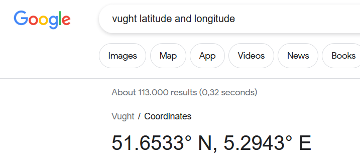

# Raspberry Pi Pico W verbinden met het Wifi

Voor deze instructie gaan we ervan uit dat je de [Raspberry Pi Pico W verbonden hebt met de DHT22 sensor](uitlezen-dht22-temperatuursensor-met-micropython.md).

Om verbinding te maken met een WiFi-netwerk, moet je de service set identifier (SSID) kennen. Dit is de naam van je WiFi-netwerk. Je hebt ook je WiFi-wachtwoord nodig. Deze gegevens zijn meestal te vinden op je draadloze router, hoewel je het standaardwachtwoord waarschijnlijk hebt gewijzigd in iets unieks.

> [!CAUTION]
> Wachtwoorden moeten veilig en privé worden bewaard. In deze stap voeg je je WiFi-wachtwoord toe aan je Python-bestand. Zorg ervoor dat je het bestand niet deelt met iemand aan wie je je wachtwoord niet zou willen vertellen.

1. Maak een nieuw bestand `verbinden-met-wifi.py`. We beginnen weer met de benodigde imports:
  ```python
  from dht import DHT22
  from machine import Pin
  from time import sleep
  import network
  import machine
  import urequests
  ```

2. Vul het SSID en wachtwoord van je netwerk in:
  ```python
  ssid = "JOUW_SSID"
  password = ""
  ```

3. We gaan nu een eigen functie maken om verbinding te maken met het netwerk. Een functie zonder parameters in Python heeft de vorm `def functienaam():`. De inhoud is net als een `if` of `while` ingesprongen. In deze `connect` functie maken we een `wlan` object aan, activeren we het en maken we verbinden met ons SSID met het gegeven wachtwoord.
  ```python
  def connect():
      wlan = network.WLAN(network.STA_IF)
      wlan.active(True)
      wlan.connect(ssid, password)
  ```

4. Als je ooit een apparaat hebt verbonden met een WiFi-netwerk, weet je dat dit niet direct gebeurt. Je apparaat stuurt verzoeken naar je WiFi-router om verbinding te maken, en wanneer de router reageert, voeren ze een zogenaamde handshake uit om een verbinding tot stand te brengen. Om dit met Python te doen, kun je een lus instellen die elke seconde verzoeken blijft sturen totdat de verbindingshandshake is voltooid:
  ```python
  def connect():
      wlan = network.WLAN(network.STA_IF)
      wlan.active(True)
      wlan.connect(ssid, password)
      while wlan.isconnected() == False:
          print("Wacht op verbinding...")
          sleep(1)
  ```

5. Wanneer de verbindingshandshake is voltooid, kun we opvragen op welk IP adres de Raspberry Pi Pico W bereikbaar is. Deze waarde geven we ook terug uit de functie met `return`, zodat iedereen die de functie aanroept het adres weet en kan gebruiken.
  ```python
  def connect():
      wlan = network.WLAN(network.STA_IF)
      wlan.active(True)
      wlan.connect(ssid, password)
      while wlan.isconnected() == False:
          print("Wacht op verbinding...")
          sleep(1)
      ip = wlan.ifconfig()[0]
      return ip
  ```

> [!TIP]
> Een **IP-adres** (Internet Protocol-adres) is een unieke numerieke identificatie die wordt toegewezen aan elk apparaat dat is verbonden met een computernetwerk. Het fungeert als een adres waarmee apparaten met elkaar kunnen communiceren via het internet of een lokaal netwerk.
>
> Er zijn twee soorten IP-adressen:
>
> **IPv4 (Internet Protocol versie 4)**: Dit is de meest voorkomende vorm van IP-adressen. Het bestaat uit vier sets van getallen, gescheiden door punten (bijvoorbeeld 192.168.1.1). Elk getal kan variëren van 0 tot 255. IPv4-adressen zijn beperkt in aantal en raken langzaam op.
> 
> **IPv6 (Internet Protocol versie 6)**: Dit is een nieuwere standaard die is ontwikkeld om het tekort aan IPv4-adressen aan te pakken. IPv6-adressen zijn veel langer en bestaan uit acht sets van vier hexadecimale cijfers, gescheiden door dubbele punten (bijvoorbeeld 2001:0db8:85a3:0000:0000:8a2e:0370:7334). IPv6 biedt een veel groter aantal mogelijke adressen.

6. Nu gaan we de functie aanroepen. Plaats al je functieaanroepen onderaan je bestand, zodat ze de laatste regels code zijn die worden uitgevoerd. Omdat de WiFi-verbinding actief kan blijven, zelfs wanneer je de code stopt, kun je een try/except-blok toevoegen dat de Raspberry Pi Pico W opnieuw instelt wanneer het script wordt gestopt.
  ```python
  try:
      ip = connect()
      print(f"Verbonden op {ip}")
  except KeyboardInterrupt:
      machine.reset()
  ```

7. Voer het programma uit. Als alles goed gaat zie je een paar keer "Wacht op verbinding..." gevolgd door een IP adres.

8. Nu kan de Raspberry Pi Pico W het internet op. We kunnen de Raspberry Pi Pico W bijvoorbeeld op laten vragen wat de huidige temperatuur in Vught is. Hiervoor gebruiken we de `get` functie van de `urequests` module.
  ```python
      response = urequests.get("https://api.open-meteo.com/v1/forecast?latitude=51.6533&longitude=5.2943&current=temperature_2m,relative_humidity_2m")
      data = response.json()
      buiten_temperatuur = data["current"]["temperature_2m"]
      print(f"Actuele buiten temperatuur in Vught op 2 meter hoogte: {buiten_temperatuur}°C")
  ```

> [!TIP]
> Een **API (Application Programming Interface)** is een set regels en protocollen waarmee verschillende softwaretoepassingen met elkaar kunnen communiceren. Het fungeert als een brug tussen verschillende systemen, waardoor ze gegevens kunnen uitwisselen en taken kunnen uitvoeren. API’s stellen ontwikkelaars in staat om functionaliteit van andere software of services te gebruiken zonder de interne werking te kennen. Ze zijn essentieel voor moderne applicaties en websites.
> 
> Wij maken hier gebruik van de gratis Open Meteo API die een antwoord geeft in het JSON (JavaScript Object Notation) formaat. JSON is een gestandaardiseerd tekstgebaseerd formaat voor het representeren van gestructureerde gegevens op basis van JavaScript-objectnotatie.

> [!TIP]
> De coördinaten van Vught zijn 51.6533 N bij 5.2943 E:
>
> 

9. Voer het programma uit. Als alles goed gaat krijg je de huidige buitentemperatuur te zien die de Raspberry Pi Pico W opgehaald heeft via de Wifi verbinding die je opgezet hebt.

10. We kunnen dit nu ook combineren met de temperatuur die we meten van de DHT22 sensor. Voeg onder de definitie van de `password` variabele de `sensor` definitie toe:
  ```python
  data_pin = Pin(28)
  sensor = DHT22(data_pin)
  ```

11. En print dan de temperatuur door dit stuk code in te voegen na het printen van de buiten temperatuur (maar binnen het `try` block)
  ```python
      sensor.measure()
      binnen_temperatuur = sensor.temperature()
      print(f"Actuele binnen temperatuur: {binnen_temperatuur}°C")
  ```

12. Voer het programma uit. Je hebt nu de buiten temperatuur via een API opgehaald en gecombineerd met je zelf gemeten binnen temperatuur.

*Gebaseerd op [Getting Started with your Raspberry Pi Pico W](https://projects.raspberrypi.org/en/projects/get-started-pico-w/2)*