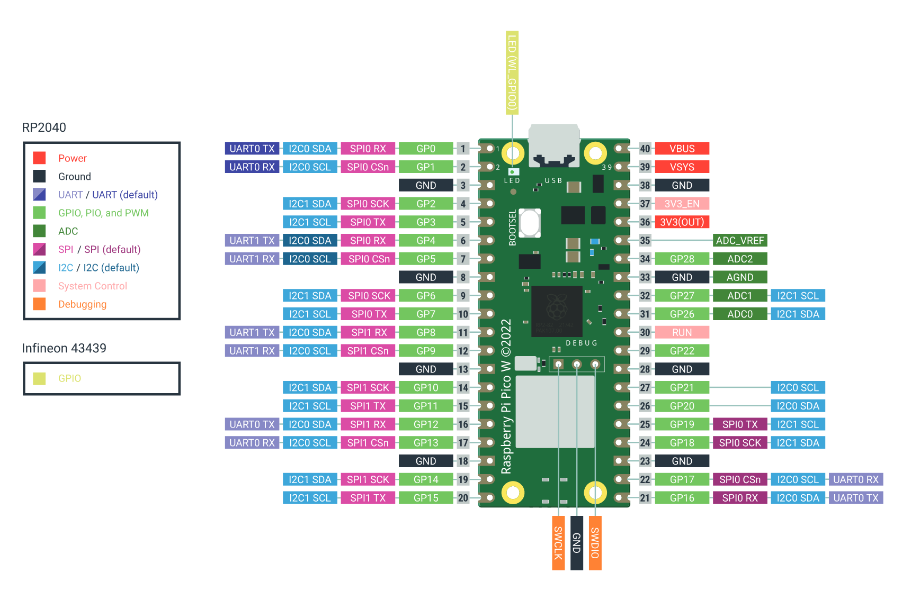
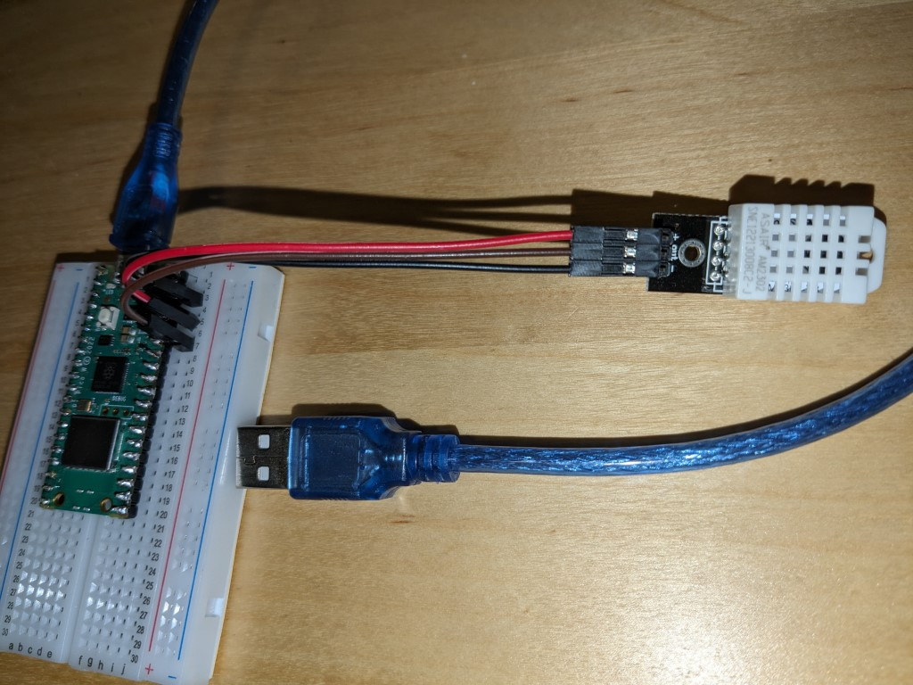

# Uitlezen van de DHT22 temperatuursensor met MicroPython

Voor dit project heb je nodig:
* De Raspberry Pi Pico
* De DHT22 sensor
* De micro USB kabel
* Het breadboard
* 3 Male to Female DuPont draden

## Het breadboard
Een **breadboard**, ook wel bekend als **steekbord**, is een handig hulpmiddel voor elektronica hobbyisten om schakelingen te bouwen zonder te solderen. Laten we eens kijken hoe het werkt:

### Wat is een Breadboard?
- Een breadboard is een rechthoekig plastic bord met kleine gaatjes erin. Deze gaatjes stellen je in staat om elektronische componenten zoals weerstanden, LED's en schakelaars te plaatsen en met elkaar te verbinden zonder dat je hoeft te solderen.
 - Het is een geweldige manier om snel en gemakkelijk te experimenteren met elektronische schakelingen.

### Hoe werkt een Breadboard?
- Aan de buitenkant van een breadboard kun je niet zien hoe de contacten lopen. De contacten worden gevormd door metalen strips die de gaatjes onderling verbinden per rij.
- In het midden van het breadboard zie je rijen met twee kolommen van vijf contacten, gelabeld a-e en f-j. Deze vijf contacten zijn met elkaar verbonden. Hierin kun je onderdelen steken die dan vervolgens met elkaar worden verbonden door de contactstrip en met behulp van breadboard steekdraden.
- De buitenste strips worden normaal gesproken gebruikt voor de energievoorziening. Hier verbind je de min (-) en de plus (+) van de batterij of voeding aan. Vanaf deze strips kun je vervolgens de onderdelen in het midden van het breadboard, waar gewenst, met steekdraden van spanning voorzien.

## Aansluiten
Plaats de Raspberry Pi Pico W op het breadboard:


> [!TIP]
> Een **GPIO-pin** op de **Raspberry Pi Pico** is een **General Purpose Input/Output-pin**. Het is een programmeerbare pin op de Raspberry Pi Pico die je kunt gebruiken om **elektronische componenten** zoals LED's, motoren en sensoren aan te sluiten. "General Purpose" betekent dat deze pinnen niet vooraf zijn toegewezen aan een specifieke functie. Je kunt ze configureren en aanpassen voor verschillende doeleinden.
> 
> **Functionaliteit van GPIO-pinnen op de Raspberry Pi Pico:**
>   - **Digitale ingangspinnen**: Deze pinnen kunnen de **toestand van externe apparaten of sensoren** lezen. Ze detecteren een **hoge (logische 1)** of **lage (logische 0)** spanning, afhankelijk van de toestand van het aangesloten apparaat².
>   - **Digitale uitgangspinnen**: Deze pinnen kunnen een **hoge (logische 1)** of **lage (logische 0)** spanning genereren om externe apparaten aan te sturen.
>   - **PWM-pinnen**: Pulse Width Modulation (PWM) pinnen kunnen worden gebruikt om **analoge signalen** te simuleren, zoals het aansturen van een servomotor of het regelen van de helderheid van een LED.
>   - **I2C-, SPI- en UART-pinnen**: Deze pinnen ondersteunen seriële communicatieprotocollen voor gegevensoverdracht tussen apparaten.
> 
> **Voltage en compatibiliteit:**
>   - De GPIO-pinnen op de Raspberry Pi Pico werken op **3,3V**. Het is belangrijk om compatibele componenten te gebruiken die ook op dit voltage werken.

De DHT22 sensor heeft 3 aansluitingen: een plus, een min en een draad voor de data. Deze moeten als volgt aangesloten worden op de Raspberry Pi Pico W:

* **VCC** (36) op de Pico gaat naar de **+** op de DHT22 sensor
* **GND** (38) op de Pico gaat naar de **-** op de DHT22 sensor
* **GP28** (34) op de Pico gaat naar de **out** op de DHT22 sensor



> [!TIP]
> Vrijwel alle elektronische componenten hebben uitgebreide datasheets vanuit de fabrikanten. Zie bijvoorbeeld de [DHT22 datasheet](datasheets/DHT22.pdf). Deze datasheets zijn vaak vrij technisch. Meestal is het handiger om te kijken of iemand al een project met het component gemaakt heeft en daar een beschrijving van heeft gegeven. Zo levert een zoektocht op Google naar "Raspberry Pi Pico DHT22" een duidelijk artikel [Raspberry Pi Pico With DHT22 – MicroPython Tutorial](https://electrocredible.com/raspberry-pi-pico-dht22-micropython-tutorial/).

Dat ziet er dan als volgt uit:


## Programmeren
De gehele voorbeeld code is te vinden in [code/uitlezen-dht22.py](code/uitlezen-dht22.py).

> [!TIP]
> MicroPython heeft allerlei ingebouwde functies (bouwblokken). Een paar functies zijn direct beschikbaar, maar de meeste functies moeten eerst geïmporteerd worden voor je ze kan gebruiken. In deze opdracht gebruiken we [standaard Python functies](https://docs.micropython.org/en/latest/library/index.html#python-standard-libraries-and-micro-libraries) zoals `time.sleep()`, maar ook [MicroPython specifieke](https://docs.micropython.org/en/latest/library/index.html#micropython-specific-libraries) zoals `machine.Pin()`. Hierdoor moet de code die we voor de Raspberry Pi Pico W schrijven ook daadwerkelijk op een Raspberry Pi Pico W uitgevoerd worden. Ondanks dat je op je computer ook Python kan draaien, zal die code niet werken op je computer. In Thonny moet je daarom de juiste interpreter ingesteld hebben, zoals beschreven in de [Introductie Raspberry Pi Pico met Thonny](introductie-raspberry-pi-pico-met-thonny.md). 

1. Open Thonny
2. Maak een nieuw bestand aan en sla hem op als: `uitlezen-dht22.py`
3. Bovenin moeten we de functies specificeren die we gaan gebruiken. Neem dit blok letterlijk over:
    ```python
    from dht import DHT22
    from machine import Pin
    from time import sleep
    ```
4. De sensor zit aangesloten op GPIO pin 28. Maak een variabele genaamd `data_pin` aan te maken en daar pin 28 aan toe te wijzen. De waarde van de variabele `data_pin` is het resultaat van de aanroep naar functie `Pin` met als argument het getal `28`:
    ```python
    data_pin = Pin(28)
    ```
    > [!TIP]
    > Een variabele is een soort van doos in het geheugen van een computer waar je een waarde in kan opslaan. Verderop in je programma kun je refereren aan deze variabele. Je kan ook een nieuwe waarde toewijzen aan een variabele. Voor meer uitleg zie [hoofdstuk 1 van Automate the boring stuff](https://automatetheboringstuff.com/2e/chapter1/).

5. Vervolgens maken we een variabele genaamd `sensor`. De sensor is een DHT22 sensor en om met de sensor te werken moeten we hem aanmaken met de `DHT22` functie. Deze functie moet weten op welke GPIO pin de sensor aangesloten zit. Dat doen we door de `data_pin` mee te geven als argument aan de functie:
    ```python
    sensor = DHT22(data_pin)
    ```

6. Nu gaan we de sensor uitlezen. We roepen hiervoor de `measure()` functie van de `sensor` aan. Die gaat een meting uitvoeren. Daarna kunnen we de temperatuur opvragen met de `temperature()` van de `sensor` en opslaan in een variabele `temperatuur`. Als laatste printen we de temperatuur. Dit gaat niet naar en echte printer, maar print de output op het scherm.
    ```python
    sensor.measure()
    temperatuur = sensor.temperature()
    print(temperatuur)
    ```

7. Probeer dit programma uit door bovenin op de groene play knop te klikken. In de Shell onderin verschijnt de huidige temperatuur als je alles goed gedaan hebt. Gaat er iets fout, lees dan aandachtig de foutmelding door. Mogelijk heb je een type fout gemaakt, waardoor de syntax niet klopt.

    > [!TIP]
    > Een AI assistent als [Microsoft CoPilot](https://copilot.microsoft.com) of [ChatGPT](https://chat.openai.com/) kunnen je op verschillende manieren helpen. Je kan vragen om code of concepten uit te leggen. Je kan vragen waar een syntax fout zit. Of je kan hele stukken code laten genereren. Vermeld bij je vragen dat je MicroPython gebruikt op de Raspberry Pi Pico W. Een punt van aandacht: deze assistenten geven een antwoord zoals ze verwachten dat een antwoord eruit ziet. Dat antwoord hoeft niet feitelijk correct te zijn, maar kan er toch uit zien als een goed antwoord. Dus bij twijfel: vraag het een expert!

8. De output van het programma is de temperatuur in graden celsius. Maar je ziet alleen een nummertje. Dit kunnen we verbeteren door een iets duidelijkere output te genereren. Vervang de regel met `print(temperatuur)` door een geformateerde tekst. In een zogenaamde f-string kun je tussen accolades refereren aan variabelen, wiens waarden dan uitgeprint worden:
    ```python
    print(f"Temperatuur: {temperatuur} graden")
    ```

9. Voer het programma opnieuw uit door op de groene play knop te klikken. Zie je in de Shell onderin je geformateerde tekst?

10. Dit programma print nu eenmalig de temperatuur en is daarna klaar met het uitvoeren van alle instructies. Als we meerdere metingen uit willen voeren dan kunnen we het meten en printen van de temperatuur in een *zolang als* lus zetten. Zolang als de conditie *waar* is, blijft de lus gaan. Als we zeggen `while True:` dan blijft de lus oneindig doorgaan, totdat het programma gestopt wordt met de Stop knop of er een fout optreedt. Voeg deze lus toe zodat de code er zo uit ziet:

    ```python
    while True:
        sensor.measure()
        temperatuur = sensor.temperature()
        print(f"Temperatuur: {temperatuur} graden")
    ```
    > [!TIP]
    > De inspringing (indentation) in Python moet secuur toegepast worden. Bij een `if`, `else`, `for` of `while` geeft het ingesprongen blok aan op welk code block het betrekking heeft. Bijvoorbeeld:
    > ```
    > print("Het basis niveau")
    > if True:
    >     print("Dit valt onder de if")
    >     print("Dit ook")
    > print("Dit niet meer, want het is niet meer ingesprongen")
    > ```

11. Voer het programma opnieuw uit door op de groene play knop te klikken. In de Shell zouden nu je temperatuurmetingen elkaar op moeten volgen.

12. De metingen volgen elkaar nu wel in heel rap tempo op. We kunnen het interval tussen de metingen aanpassen door het programma tussen de metingen te laten pauzeren. In computertaal laten we het programma *slapen* met de `sleep()` functie die als argument het aantal seconden meekrijgt. Voeg de regel `sleep(5)` toe in de `while True:` lus.

13. Voer het programma opnieuw uit door op de groene play knop te klikken. Zit er een korte pauze van vijf seconden tussen de metingen? Zo niet: heb je op de inspringing gelet?

14. De DHT22 sensor kan ook de luchtvochtigheid meten met de `humidity()` functie. Breidt je programma uit zodat ook de luchtvochtigheid uitgeprint wordt.