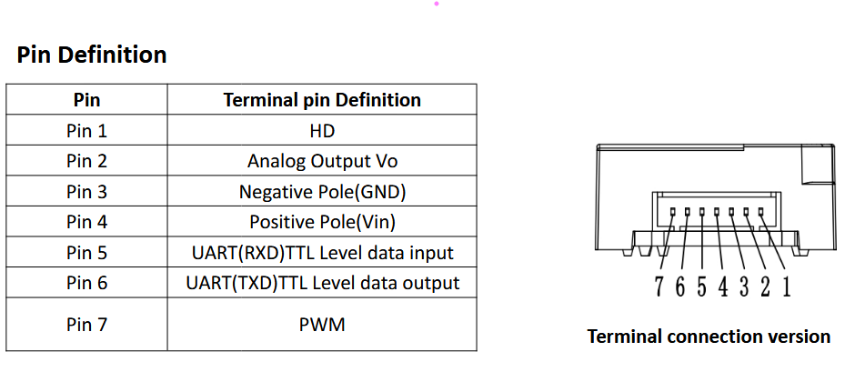
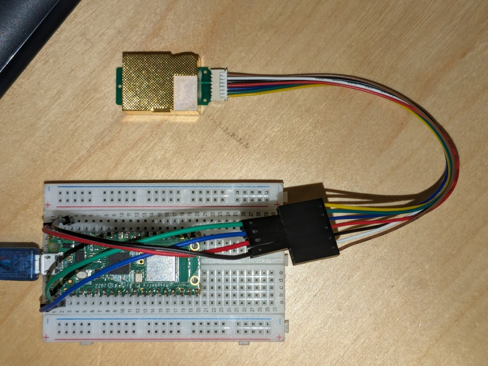
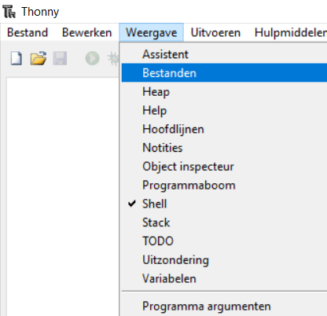
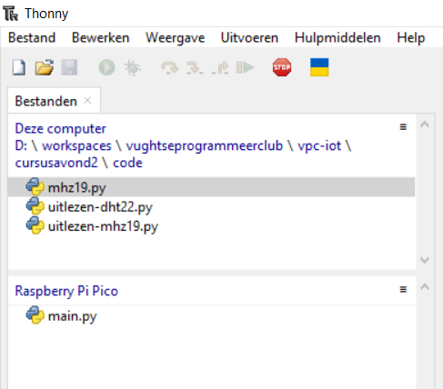
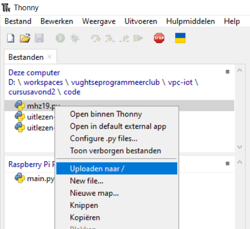
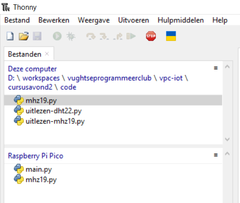
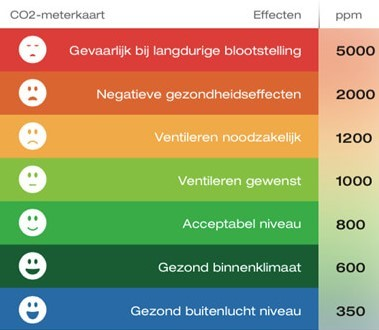

# Uitlezen van de MHZ19 CO2 sensor met MicroPython

Voor dit project heb je nodig:
* De Raspberry Pi Pico
* De MHZ19 sensor
* De micro USB kabel
* Het breadboard
* De 7 pins Molex PicoBlade naar DuPont kabel
* 4 Male to Male DuPont draden

## Aansluiten
Plaats de Raspberry Pi Pico W op het breadboard:


De DHT22 sensor heeft 7 aansluitingen, waarvan wij er 4 gaan gebruiken om een verbinding via UART op te zetten.

> [!TIP]
> **UART (Universal Asynchronous Receiver-Transmitter)** is een seriële communicatie-interface die wordt gebruikt om gegevens tussen apparaten te verzenden en ontvangen. Het is een eenvoudig protocol dat asynchrone communicatie mogelijk maakt, wat betekent dat er geen gedeelde klok is tussen de zender en de ontvanger. UART wordt vaak gebruikt om microcontrollers, sensoren, displays en andere randapparatuur met elkaar te verbinden.
> 
> De Raspberry Pi Pico W heeft twee UART-kanalen (UART0 en UART1) die kunnen worden geconfigureerd voor seriële communicatie. Bij het aansluiten van apparaten moet opgelet worden dat de zend pin (TX / transmit) van het ene apparaat aan de ontvang pin (RX / receive) verbonden wordt.

We gebruiken: een plus (rood), een min (zwart) en blauwe en groene draden voor de data. Deze moeten als volgt aangesloten worden op de Raspberry Pi Pico W:

* **GND** (38) op de Pico gaat naar de **Negative Pole** (3, zwart) op de MHZ19 sensor
* **VBUS** (40) op de Pico gaat naar de **Positive Pole** (4, rood) op de MHZ19 sensor
* **GP0 / UART0 TX** (1) op de Pico gaat naar de **UART(RXD)** (5, blauw) op de MHZ19 sensor
* **GP1 / UART0 RX** (2) op de Pico gaat naar de **UART(TXD)** (6, groen) op de MHZ19 sensor




> [!TIP]
> De MHZ19 werkt het beste met 5 volt, maar de Pi Pico is maar 3,3 volt. Door aan te sluiten op **VBUS** maken we direct gebruik van de stroom van de USB poort, die wel 5 volt levert.

Dat ziet er dan als volgt uit:


## Een library uploaden naar de Raspberry Pi Pico W
In dit programma maken we gebruik van functies die niet standaard beschikbaar zijn op de Raspberry Pi Pico W. Een manier om deze functies toch beschikbaar te maken is om ze op de Raspberry Pi Pico W te plaatsen. Dat gaat als volgt:

* Download [`mhz19.py`](code/mhz19.py). Klik rechtsboven op het Download icoontje .

* In Thonnie, klik bovenin op "Weergave" en vink "Bestanden" aan. Je ziet nu zowel de bestanden op je eigen computer als op de Raspberry Pi Pico W.

  
* Open de map waar `mhz19.py` staat.

  

* Klik met de rechter muisknop op het bestand `mhz19.py` en selecteer "Uploaden naar /"

  

> [!Important]
> Zorg dat je programma gestopt is door op de Stop knop te klikken voordat je een bestand probeert te uploaden.

* Het bestand staat nu op de Raspberry Pi Pico W. Alle mhz19 functies zijn nu beschikbaar in je programma.

  

> [!NOTE]
> Voor wie diep de materie in wil: de mhz19 functies regelen de communicatie via UART. Het protocol van de sensor wordt gespecificeerd in de handleiding van de [MH-Z19C sensor](datasheets/MH-Z19C.pdf). In [`mhz19.py`](code/mhz19.py) zie je bijvoorbeeld de beschreven CRC functie en het verzenden van de specifieke bytes om data te ontvangen.

## Programmeren
1. Maak een nieuw bestand aan en sla hem op als: `uitlezen-mhz19.py`
2. Bovenin moeten we weer de functies specificeren die we gaan gebruiken. Neem dit blok letterlijk over:
  ```python
  from mhz19 import mhz19
  from time import sleep
  ```

3. De rest van de code lijkt op de DHT22 code: we maken een variabele genaamd `sensor`. De sensor is een mhz19 sensor en om met de sensor te werken moeten we hem aanmaken met de `mhz19` functie. Deze functie moet weten op welke UART pinnen de sensor aangesloten zit. Die zit aangesloten op `UART0`, dus geven het getal `0` mee als argument aan de functie:
  ```python
  sensor = mhz19(0)
  ```

4. Nu gaan we de sensor uitlezen. We roepen hiervoor de `get_data()` functie van de `sensor` aan. Die gaat een meting uitvoeren. Daarna kunnen we de temperatuur opvragen met de `temp` waarde van de `sensor` en direct gebruiken in een print statement.
  ```python
  sensor.get_data()
  print(f"Temperatuur: {sensor.temp} graden Celsius")
  ```

5. Probeer dit programma uit door bovenin op de groene play knop te klikken. In de Shell onderin verschijnt de huidige temperatuur als je alles goed gedaan hebt.

> [!TIP]
> De temperatuursensor niet zo nauwkeurig als de DHT22 sensor, dus de temperatuur is een grove benadering.

6. De `get_data()` functie geeft een waarde `1` terug als die succesvol data heeft kunnen lezen. Bij een waarde van `0` dan is er iets misgegaan. Als het mis is gegaan hoeven we niet de temperatuur te printen. Dus maken we ons programma robuuster:
  ```python
  if sensor.get_data():
      print(f"Temperatuur: {sensor.temp} graden Celsius")
  else:
      print("Geen data ontvangen")
  ```

7. De CO2 waarde kunnen we opvragen met de `ppm` waarde van de `sensor`. Voeg een extra print statement toe wat de CO2 waarde print.

> [!TIP]
> De CO2 sensor heeft een opwarmtijd van enkele minuten. Tot die tijd laat die een sensor waarde van 500 of 515 zien. De maximum detectie waarde is 2000 ppm CO2. Hoger wordt ook gerapporteerd als 2000 ppm. Zie onderstaande tabel voor acceptabele CO2 waarden:
>
> 

8. Zet de metingen in een `while True:` loop om de opwarmtijd te overbruggen.

De gehele voorbeeld code is te vinden in [code/uitlezen-mhz19.py](code/uitlezen-mhz19.py).