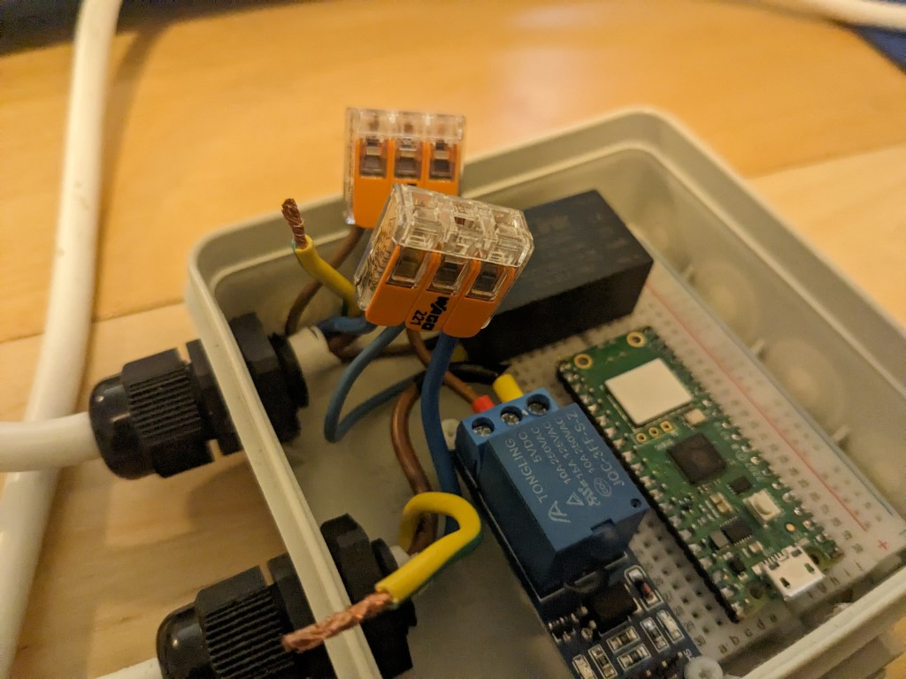
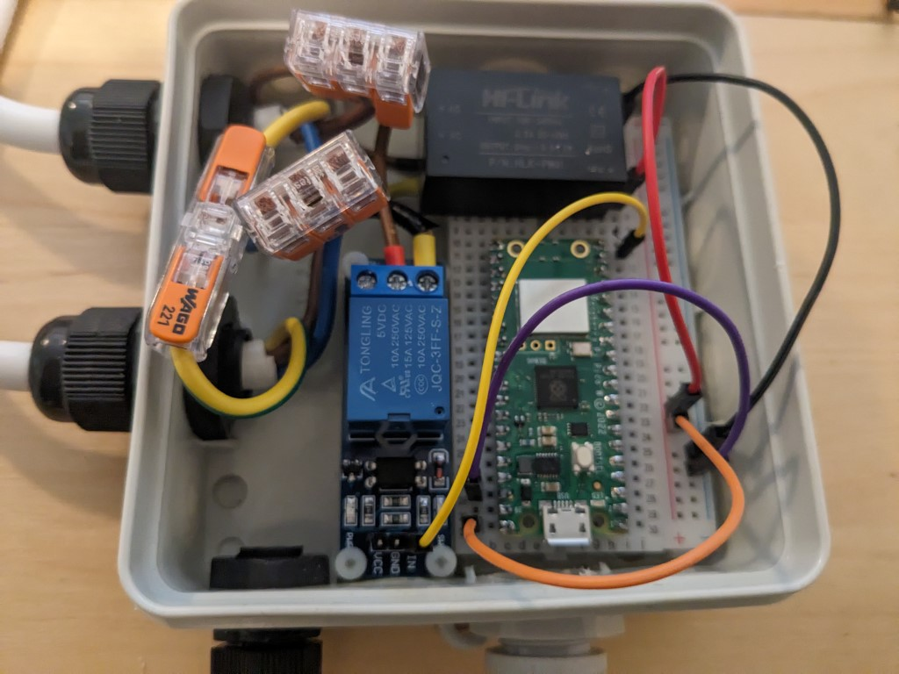

# Stekkerdoos via relais schakelen met de Raspberry Pi Pico W

*Voorkennis: dit project gaat er van uit dat je de [Introductie microPython + Thonny](../cursusavond2/1-introductie-raspberry-pi-pico-met-thonny.md) voltooid hebt.*

In dit project gaan we de Raspberry Pi Pico W een stekkerdoos aan en uit laten schakelen aan de hand van een timer. In de vervolgopdrachten gaan we dit programma uitbreiden met de mogelijkheid om via het Wifi te schakelen en aan de hand van sensorwaarden.

> [!CAUTION]
> Bij deze opdracht werken we met 230 Volt wisselspanning. Dit kan leiden tot een schok. Werk nooit aan apparatuur of opstellingen die onder spanning staan. Volg daarom de volgende richtlijnen:
> 
> * Laat je werk controleren voordat je je project inplugt. We kijken of de aansluitingen goed zitten en metalen delen elkaar niet raken.
> * Leg na goedkeuring het deksel op de kabeldoos, om aanraking met spanningsvoerende delen te beperken. Steek nu pas de stekker in het contact.
> * Maak je wijzigingen: schakel altijd eerst de spanning uit! Haal de stekker uit het stopcontact en trek je snoer naar je toe, zodat niet iemand anders hem per ongeluk inplugt als je bezig bent.
> * Ga niet met de kabeldoos schudden als de componenten niet vast zitten.
> * Zet geen 230 Volt op het breadboard.
> * Het relais wat we gebruiken kan maximaal 10 Ampere schakelen. Sluit geen zware apparaten (zwaarder dan 2000 Watt) op dit project aan.

Voor dit project heb je nodig:
* De Raspberry Pi Pico W
* De micro USB kabel
* Het breadboard
* Het relais (blauw blok op PCB, in verpakking)
* De PCB voeding (zwart blokje met 2 gesoldeerde draden)
* 2 Wago verbinders met 3 aansluitingen
* 1 Wago doorverbinder met 2 aansluitingen
* 3 Male to Female DuPont draden
* 4 Male to Male DuPont draden

## Aansluiten

Volg deze stappen nauwkeurig en laat aan het einde je werk controleren.

1. Open het doosje.

    

2. Verwijder de 3 kleine nylon schroefjes.

    

3. Neem het losse bruine draadje en schroef deze in de COM kant van het relais (middelste schroef terminal). Eerst de terminal iets losschroeven, dan de kant van het draadje met de adereindhuls insteken en dan vastzetten. Vast aandraaien, maar niet zo hard dat je de schroef stript of dingen kapot maakt.

    

4. Schroef de geschakelde draad van de stekkerdoos (bruine draad met adereindhuls en zwarte tape) in de NO terminal van het relais (linker schroef terminal, kijkend naar de letters).

    

> [!TIP]
> Een relais is een elektromechanisch apparaat dat werkt als een schakelaar. Het wordt gebruikt om een elektrisch circuit te openen of te sluiten. Een relais heeft drie belangrijke aansluitingen: COM (Common), NO (Normally Open) en NC (Normally Closed). Als het relais geen stroom krijgt, maakt de COM-aansluiting contact met de NC-aansluiting. Als het relais wel stroom krijgt, maakt de COM-aansluiting contact met de NO-aansluiting. Dit maakt het mogelijk om een circuit te besturen met een lage stroomingang (bijvoorbeeld van een microcontroller zoals de Raspberry Pi Pico W), terwijl een ander circuit met een hoge stroom wordt geschakeld.

5. Schroef het relais op zijn plek met de 3 schroefjes.

    

6. Plaats de Raspberry Pi Pico W op je breadboard, zorg dat de USB poort helemaal aan de rand van het breadboard zit.

    

7. Plaats de PCB voeding op je breadboard. Plaats de -V0 terminal in breadboardlocatie H0 en +V0 terminal in breadboard locatie H7.

    

8. Plaats het breadboard in het doosje, naast het relais. Voor het blauwe draadje van de PCB voeding onder de draden van het relais door.

    

> [!CAUTION]
> Nu we nog met de opdrachten aan het prototypen zijn zetten we het breadboard nog niet vast. Wil je later deze stekkerdoos permanent op een vaste plek gebruiken, zet het breadboard dan vast met de dubbelzijdige tape die al onder het breadboard zit. Wanneer de stekkerdoos verplaatst of bewogen gaat worden: gebruik geen breadboard en soldeer de verbindingen.

9. Sluit de 3 bruine draden aan op het Wago blokje met 3 aansluitingen. Trek het oranje hendeltje omhoog. Steek de kabel er volledig in. Duw het hendeltje omlaag. Verifiëer dat de kabel er volledig inzit (visueel door het doorzichtige plastic, geen losse strengen) en vast zit (licht trekken aan de kabel en het blokje). De 3 draden die aangesloten worden zijn (1) de bruine kabel van de PCB voeding, (2) de bruine kabel uit de COM poort van het relais en (3) de bruine kabel van de stekker.

    

10. Sluit de 3 blauwe draden aan op het tweede Wago blokje met 3 aansluitingen. Dit zijn (1) de blauwe kabel van de PCB voeding, (2) de blauw kabel van de stekkerdoos en (3) de blauwe kabel van de stekker

    

11. Sluit de 2 groen-gele draden aan op de Wago doorverbinder met 2 aansluitingen. Dit zijn (1) de groen-gele kabel van de stekkerdoos en (2) de groen-gele kabel van de stekker.

    

> [!TIP]
> In Nederland worden de volgende kleuren gebruikt voor de bedrading in elektrische huisinstallaties:
> * Bruin: Fasedraad (L) - Dit is de aanvoerdraad van de stroom.
> * Blauw: Nuldraad (N) - Dit is de afvoerdraad van de stroom.
> * Geel/Groen: Aardedraad (PE) - Deze draad zorgt voor ontlading en afvoer van spanning.
> * Zwart: Schakeldraad (T) - Deze draad wordt gebruikt waar stroom doorgaat bij aan- en uitsignaal bij schakelaars.

12. Sluit de **-V0** van de PCB voeding aan met een Male to Male DuPont draad op de **-** strook van het breadboard.

    

13. Sluit de **+V0** van de PCB voeding aan met een Male to Male DuPont draad op de **+** strook van het breadboard.

    

> [!TIP]
> Een 5-volt PCB (Printed Circuit Board) voeding is een apparaat dat elektrische energie levert aan de componenten op een printplaat of breadboard. Het zet de inkomende 230-volt spanning om naar een stabiele 5-volt uitgang, die wordt gebruikt om de elektronische componenten op de printplaat of breadboard van stroom te voorzien. In de volgende opdrachten zorgt deze voeding er voor dat de Raspberry Pi Pico W ook voorzien is van stroom wanneer er geen USB kabel aangesloten is.

14. Sluit pin **GND** (38) van de Raspberry Pi Pico aan met een Male to Male DuPont draad op de **-** strook van het breadboard.

    

15. Sluit pin **VCC** (40) van de Raspberry Pi Pico aan met een Male to Male DuPont draad op de **+** strook van het breadboard.

    

16. Sluit pin **GP15** (20) van de Raspberry Pi Pico aan met een Male to Female DuPont draad op de **IN** pin van het relais.

    

16. Sluit de de **GND** pin van het relais aan met een Male to Female DuPont draad op **-** strook van het breadboard.

    

17. Sluit de de **VCC** pin van het relais aan met een Male to Female DuPont draad op **+** strook van het breadboard.

    

18. Plug je USB kabel in de Raspberry Pi Pico W. Hiervoor zul je het breadboard iets op moeten lichten. Let op dat de PCB voeding ingeplugd blijft.

    

Laat je werk controleren door de begeleiders. Leg hierna het dekseltje op de kabeldoos, zodat je niet per ongeluk in aanraking komt met 230 Volt. Plug de kabeldoos pas in als je hem geprogrammeerd hebt.

## Programmeren

De gehele voorbeeld code is te vinden in [code/relais-automatisch-schakelen.py](code/relais-automatisch-schakelen.py).

1. Open Thonny
2. Maak een nieuw bestand aan en sla hem op als: `relais-automatisch-schakelen.py`
3. Bovenin moeten we de functies specificeren die we gaan gebruiken. Neem dit blok letterlijk over:
    ```python
    from machine import Pin
    from time import sleep
    ```
4. Het relais zit aangesloten op GPIO pin 15. Maak een variabele genaamd `relais_pin` aan te maken en daar pin 15 aan toe te wijzen. Zet de initiële output waarde van de pin op 0:
    ```python
    relais_pin = Pin(15, Pin.OUT, value=0)
    ```

5. We moeten bijhouden wat de huidige staat van het relais is. Maak een variable `relais_aan` met de boolean waarde `False`.
    ```python
    relais_aan = False
    ```

6. In een oneindige lus kunnen we nu automatisch het relais elke 5 seconden van staat laten wisselen. Is het relais aan, zet het dan uit en update de `relais_aan` staat naar `False`. Is het relais uit, zet het dan aan en update de `relais_aan` staat naar `True`. Wacht dan 5 seconden:
    ```python
    while True:
        if relais_aan:
            relais_pin.off()
            relais_aan = False
        else:
            relais_pin.on()
            relais_aan = True
        
        sleep(5)
    ```

7. Test het programma zonder de stekker er in te steken! Voer het programma uit door op de groene play knop te klikken. Als het goed is hoor je het relais elke 5 seconden klikken en zie de led op het relais aan en uit gaan.

    

> [!TIP]
> `main.py` is het standaard uitvoerbare bestand op de Raspberry Pi Pico W. Wanneer je de Pico inschakelt, wordt dit bestand automatisch uitgevoerd.

8. Hernoem je programma nu naar `main.py`.
9. Stop je draaiende programma met de stop knop.
10. Upload `main.py` naar de Raspberry Pi Pico W met Thonny. Dit gaat op dezelfde manier als een [library uploaden naar de Raspberry Pi Pico W](../cursusavond2/5-uitlezen-mhz19-co2-sensor-met-micropython.md#een-library-uploaden-naar-de-raspberry-pi-pico-w)).
11. Unplug de USB kabel van de Raspberry Pi Pico W.
12. Zet de schakelaar van je stekkerdoos aan.
13. **Laat je opstelling controleren door de begeleiding.**
14. Na goedkeuring: sluit de kabeldoos af door het deksel erop te doen. Let op dat je de kabels een plekje in het doosje geeft zodat ze geen kortsluiting maken.
15. Steek de stekker in het beveiligde stopcontact. Als alles goed aangesloten zit, krijgt de Raspberry Pi Pico W stroom vanuit de PCB voeding. De Raspberry Pi Pico W start op en gaat de geüploade `main.py` uitvoeren. Het relais wisselt elke 5 seconden van staat, wat zichtbaar moet zijn in de schakelaar van je stekkerdoos.
16. **Haal de stekker uit het stopcontact voordat je verder programmert of aan de volgende opdracht begint!**
