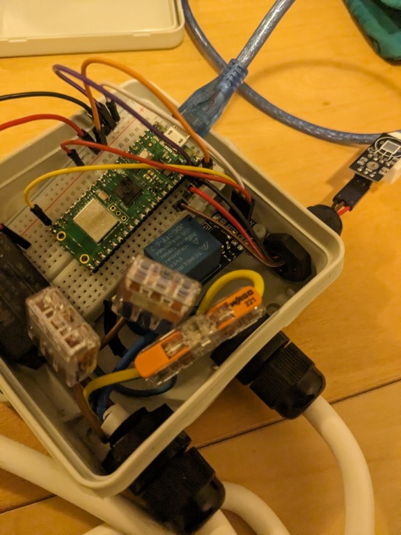

# Stekkerdoos via relais schakelen op basis van temperatuur

*Voorkennis: dit project gaat er van uit dat je de [Stekkerdoos via relais schakelen met de Raspberry Pi Pico W](1-stekkerdoos-via-relais-schakelen-met-de-raspberry-pi-pico-w.md) en [Uitlezen van de DHT22 temperatuursensor met MicroPython](../cursusavond2/2-uitlezen-dht22-temperatuursensor-met-micropython.md) voltooid hebt.*

**Haal de stekker uit het stopcontact voordat je verder programmert of aan de volgende opdracht begint!**

In dit project gaan we onze web-server uitbreiden met knoppen om de 

Voor dit project heb je nodig:
* De Raspberry Pi Pico W
* De micro USB kabel
* Het breadboard
* Het relais (blauw blok op PCB, in verpakking)
* De PCB voeding (zwart blokje met 2 gesoldeerde draden)
* 2 Wago verbinders met 3 aansluitingen
* 1 Wago doorverbinder met 2 aansluitingen
* 6 Male to Female DuPont draden
* 4 Male to Male DuPont draden
* De DHT22 temperatuur sensor

## Aansluiten
1. De aansluting begint hetzelfde als [Stekkerdoos via relais schakelen met de Raspberry Pi Pico W](1-stekkerdoos-via-relais-schakelen-met-de-raspberry-pi-pico-w.md#aansluiten).
2. Vraag bij de begeleiding een extra kabelwartel en doordruk tool. Monteer de wartel linksonder in de kabeldoos.
3. Voer de stekkertjes van het de DHT22 sensor één voor één door de wartel.
4. Sluit de stekkers van de sensor aan. De draadjes zijn wat kort, dus plug ze naast de Raspberry Pi Pico W in. **VCC** (36) op de Pico gaat naar de **+** op de DHT22 sensor
5. **GND** (38) op de Pico gaat naar de **-** op de DHT22 sensor
6. **GP28** (34) op de Pico gaat naar de **out** op de DHT22 sensor
7. Draai de wartel vast.

    

## Programmeren
De gehele voorbeeld code is te vinden in [code/relais-schakelen-op-basis-van-temperatuur.py](code/relais-schakelen-op-basis-van-temperatuur.py).

We gaan de code van [Stekkerdoos via relais schakelen met de Raspberry Pi Pico W](1-stekkerdoos-via-relais-schakelen-met-de-raspberry-pi-pico-w.md) en [Uitlezen van de DHT22 temperatuursensor met MicroPython](../cursusavond2/2-uitlezen-dht22-temperatuursensor-met-micropython.md) combineren om het relais aan te laten gaan als een bepaalde temperatuur bereikt wordt.

1. Maak een nieuw bestand aan: `relais-schakelen-op-basis-van-temperatuur.py`.
2. Bovenin moeten we de functies specificeren die we gaan gebruiken. Neem dit blok letterlijk over:
    ```python
    from dht import DHT22
    from machine import Pin
    from time import sleep
    ```

3. We moeten nu twee pinnen gebruiken, Het relais zit nog op GPIO pin 15 en de sensor is weer aangesloten op GPIO pin 28.
    ```python
    data_pin = Pin(28)
    sensor = DHT22(data_pin)
    relais_pin = Pin(15, Pin.OUT, value=0)
    relais_aan = False
    ```

4. Lees de temperatuur uit en stop die weer in een variabele:
    ```python
    sensor.measure()
    temperatuur = sensor.temperature()
    print(temperatuur)
    ```

5. Nu kunnen we een de temperatuur vergelijken om te bepalen of het relais aan moet:
    ```python
    if temperatuur > 20:
        relais_pin.on()
        relais_aan = True
    else:
        relais_pin.off()
        relais_aan = False
    ```

6. Zet het meten en vergelijken weer in een loopje om het periodiek uit te voeren:
    ```python
    while True:
        sensor.measure()
        temperatuur = sensor.temperature()
        print(temperatuur)

        if temperatuur > 20:
            relais_pin.on()
            relais_aan = True
        else:
            relais_pin.off()
            relais_aan = False
        
        sleep(5)
    ```

7. Test het programma zonder de stekker er in te steken! Voer het programma uit door op de groene play knop te klikken.De test temperatuur kun je verhogen door de sensor in je handen te houden, of naast de ventilator van je laptop te leggen.

8. Als de temperatuur precies rond de 20 graden ligt zal het relais heel de tijd aan en uit gaan (flapperen). Hoe zou je dit op kunnen lossen?