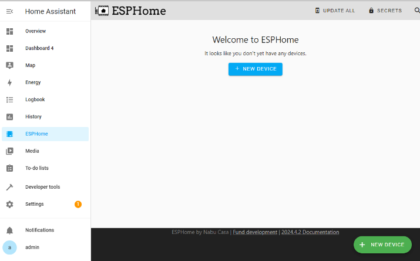
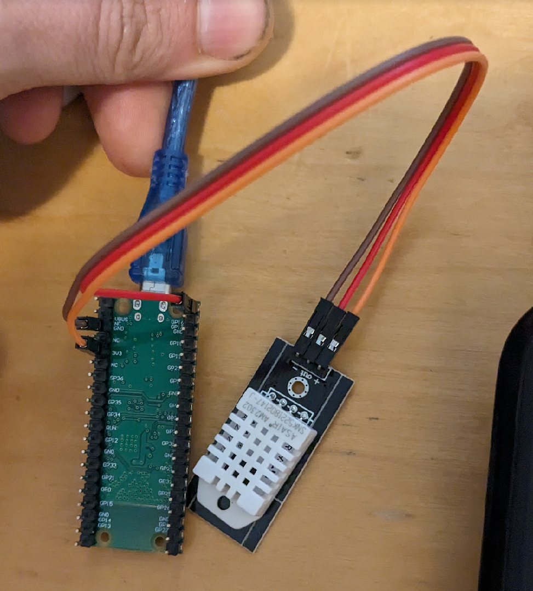

# Programma Cursusavond 5

Deze vijfde avond gaan we de vorige lessen combineren en gaan we onze hardware koppelen aan Home Assistant. Deze avond begint met een korte presentatie om het verschil tussen de Raspberry Pi Pico W en de MakePico ESP32 uit te leggen. Daarna gaan we weer aan de slag met Home Assistant en ESPHome.

# De Home Assistant omgevingen
Er zijn 4 NUCs die elke een Home Assistant hosten.
* Maak verbinding met het netwerk HomeAssistant, wachtwoord 12345678
* Gebruik de volgend links om bij HomeAssistant te komen:
    * Groep 1: http://ha1.local:8123
    * Groep 2: http://ha2.local:8123
    * Groep 3: http://ha3.local:8123
    * Groep 4: http://ha4.local:8123
* De gebruikersnaam is admin, het wachtwoord is admin of gebruik het gebruikersnaam en wachtwoord wat je op avond 4 ingesteld hebt.

# Opzetten van de ESPHome Add-On in Home Assistant

*Dit hoeft maar één keer per Home Assistant omgeving gedaan worden*

> [!TIP]
> Add-ons zijn uitbreidingen die extra functionaliteiten aan Home Assistant toevoegen, zoals mediaspelers of andere software, maar ook andere protocollen om met meer verschillende slimme apparaten te verbinden.
>
> Add-ons alleen beschikbaar in de installatie methoden HA OS en Supervised (bijvoorbeeld op een NUC of Raspberry Pi), niet met enkel de Container of Core.

* Ga naar de **Settings** van Home Assistant en selecteer **Add-ons**.
    
* Klik rechtsonder op **ADD-ON STORE**.
    
* Zoek de ESPHome add-on en klik erop.
    
* Klik op **Install**. Vink ook aan dat de Add-on in het menu beschikbaar is. De add-on is nu geïnstalleerd. 

# Een ESP apparaat toevoegen aan Home Assistant

In deze stappen gaan we een nieuw ESP apparaat aan Home Assistant toevoegen, zodat Home Assistant het apparaat kan aansturen en uitlezen. Deze basis stappen zijn voor alle ESP apparaten hetzelfde.

> [!TIP]
> Er zijn verschillende manieren om via ESPHome een ESP apparaat te installeren:
>
> * Installatie over USB via de [ESPHome webpagina](https://web.esphome.io/). Hiervoor moet je Chrome of Edge gebruiken.
> * Installatie over USB met het geïnstalleerd programma `esphome`.
> * Na een initiële installatie via USB is het ook mogelijk om via Wifi Over The Air (OTA) updates te doen. Dit gaat nog wel eens fout, daarom gebruiken we in deze handleiding telkens het installeren via USB.
    
* Klik op **ESPHome** in de zijbalk. Hier worden alle ESPHome apparaten zichtbaar die Home Assistant kan bereiken.
* Klik op **New Device**.
    
* Deze melding geeft aan dat het niet mogelijk is om direct vanuit Home Assistant je configuratie te installeren over USB. Dit is geen probleem voor nu, dus selecteer **Continue**
    > [TIP!]
    > Mocht je je Home Assistant wel via HTTPS open hebben, bijvoorbeeld omdat je het via NabuCasa of een andere manier opengesteld hebt naar het internet, dan kun je wel direct vanuit Home Assistant je configuratie installeren.
    
    
* Geef je configuratie een naam, bijvoorbeeld "Joep's temperatuursensor". De voorbeelden gebruiken "Mijn Sensor".
    
* Selecteer als type **ESP32**.
    
* Je apparaat is nu klaar voor installatie. Maar het zal nog niet veel doen omdat het nog geen functie toegewezen heeft gekregen, dus selecteer daarom **Skip**. Vervolg met de stappen uit ofwel [DHT22 sensor waarden uitlezen](#dht22-sensor-waarden-uitlezen) ofwel [Relais schakelen](#relais-schakelen) om je apparaat een functie te geven.
    

# DHT22 sensor waarden uitlezen
* Op de **ESPHome** pagina in HomeAssistant, klik op **Edit** van je ESP apparaat, te herkennen aan de naam die je het in de vorige stappen hebt gegeven. In deze voorbeelden het het Mijn Sensor.
    
* Dit opent de configuratie pagina.
    > [TIP!]
    > De configuratie is in het YAML formaat. YAML staat voor: YAML Ain't Markup Language™. Het is een mens-vriendelijke data taal geschikt voor alle programmertalen. Let op dat YAML net als Python gevoelig is voor inspringing en juist gebruik van aanhalingstekens.
    
* De configuratie bevat standaard de volgende ingestelde waarden:
    * De technische naam (geen spaties toegestaan).
    * De leesbare naam.
    * Dat we een generieke ESP32 hebben, die we met arduino code laten programmeren.
    * Dat we graag log output willen hebben, zodat we inzicht kunnen krijgen in wat er op de ESP32 gebeurt. Handig bij het oplossen van problemen.
    * Een key voor de ESP om met Home Assistant te communiceren.
    * Een wachtwoord voor Over The Air updates
    * Het Wifi SSID en wachtwoord dat in Home Assistant ingesteld zijn.
    * Een backup wifi configuratie, mocht het ingestelde Wifi netwerk niet bereikbaar zijn, dan kan er alsnog via Wifi direct verbonden worden met de ESP om de Wifi instellingen te wijzigen.
* Sluit de DHT22 sensor als volgt aan:
    * **VCC** op de MakePico ESP32 gaat naar de **+** op de DHT22 sensor
    * **GND** op de MakePico ESP32 gaat naar de **-** op de DHT22 sensor
    * **GP16** op de MakePico ESP32 gaat naar de **out** op de DHT22 sensor

    
    
* Wijzig de configuratie en voeg het volgende configuratie blok onderaan in de file toe. Hiermee vertellen we de ESP32 dat er een DHT22 sensor aangesloten zit op pin GPIO16. De temperatuur en luchtvochtigheid worden elke 10 seconden gemeten en doorgegeven aan Home Assistant. Alle beschikbare configuratie parameters staan beschreven op de [ESPHome DHT pagina](https://esphome.io/components/sensor/dht.html) en [ESPHome sensor configuratie pagina](https://esphome.io/components/sensor/#config-sensor)

    ```yaml
    sensor:
    - platform: dht
      model: DHT22
      pin: GPIO16
      temperature:
        name: "Living Room Temperature"
      humidity:
        name: "Living Room Humidity"
        accuracy_decimals: 1
      update_interval: 10s
    ```
    
* Klik rechtsboven op **Install**. Er wordt gevraagd hoe je de sensor wil installeren. Kies hier voor **Manual Download**.
    
* Het ESP32 programma wordt gegenereerd aan de hand van de configuratie. Dit kan twee minuten duren, waarna dit scherm getoond wordt. Download de **Modern format**.
    
* Omdat de bestandsextensie `.bin` is, vindt Chrome het een eng bestand. Selecteer **Keep** om de download toch op te slaan.
    
* Ga in een nieuw tabblad in je browser naar https://web.esphome.io en selecteer **Connect**.
    
* De browser vraagt nu met welk USB apparaat je wil verbinden. Selecteer de **USB Serial**.
    
* Als de verbinding succesvol is, dan zie je dit scherm. Selecteer **Install**.
    
* Selecteer de file met de `.bin` extensie die je gedownload hebt.
    
* Klik op **Install**.
    
* De huidige ESP32 programma wordt verwijderd voordat het nieuwe programma erop gezet wordt.
    
* Het nieuwe ESP32 programma wordt erop gezet wordt. Dit kan twee minuten duren.
    
* Als de installatie voltooid is zie je dit scherm. Klik op **Close**.
    
* Of de ESP32 werkt kunnen we bekijken door op de **Logs** te klikken. Hier worden elke 10 seconden de sensor waarden weergegeven.
    

* Ga terug naar het ESPHome tab in Home Assistant. Hier kunnen we ook de logs bekijken door bij "Mijn Sensor" op **Logs** te klikken.
    
* Ook hier zien we de sensor waarden periodiek voorbij komen.
    
* Nu moeten we onze ESP32 met sensor toevoegen als Device in Home Assistant. Ga naar de **Settings** -> **Devices**. Daar zou de sensor zichtbaar moeten zijn onder "Discovered". Selecteer **Configure**:
    
* Kies **Submit**:
    
* De ESP32 met sensor is nu succesvol als device geregistreerd. Voeg het toe aan een ruimte.
    
* Nu komen de sensor waarden op het standaard dashboard. Klik op **Overview** aan de linkerkant in het menu:
    
* Je kan de sensor waarden ook toevoegen aan een dashboard.
    
* De sensor waarden zijn nu ook in Automations te gebruiken.

# Links
* Mocht het installeren van de ESP32 via USB niet werken staan hier wat tips: https://esphome.io/guides/faq.html#i-can-t-get-flashing-over-usb-to-work
* [Datasheet van de MakePico](datasheets/esp32-D0WDQ6_datasheet_en.pdf)
